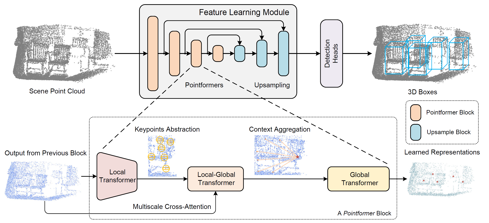

# 3D Object Detection with Pointformer

This repository contains the code for the paper 3D Object Detection with Pointformer (CVPR 2021) \[[arXiv](https://arxiv.org/abs/2012.11409)\]. This work is developed on the top of [MMDetection3D](https://github.com/open-mmlab/mmdetection3d) toolbox and includes the models and results on **SUN RGB-D** and **ScanNet** datasets in the paper. 



More models results on KITTI and nuScenes datasets will be released soon. 

## Installation and Usage

The code is developed with MMDetection3D v0.6.1 and works well with v0.14.0.

### Dependencies

- NVIDIA GPU + CUDA 10.2
- Python 3.8 (Recommend to use Anaconda)
- PyTorch == 1.8.0
- [mmcv-full](https://github.com/open-mmlab/mmcv) == 1.3.7
- [mmdet](https://github.com/open-mmlab/mmdetection) == 2.11.0
- [mmsegmentation](https://github.com/open-mmlab/mmsegmentation) == 0.13.0

### Installation

1. Install dependencies following their guidelines.
2. Clone and install [mmdet3d](https://github.com/open-mmlab/mmdetection3d) in develop mode.

```
git clone https://github.com/open-mmlab/mmdetection3d.git
cd mmdetection3d
python setup.py develop
```

3. Add the files in this repo into the directories in mmdet3d.

### Training and Testing

Download the pretrained weights from [Google Drive](https://drive.google.com/drive/folders/1UcfigZt2ayiDCLP_iJgbUjM3a9HWqkmJ?usp=sharing) or [Tsinghua Cloud](https://cloud.tsinghua.edu.cn/d/12f0ee13f7984c0fb338/) and put them in the `checkpoints` folder. Use `votenet_ptr_sunrgbd-3d-10class` as an example:

```
# Training
bash -x tools/dist_train.sh configs/pointformer/votenet_ptr_sunrgbd-3d-10class.py 8

# Testing 
bash tools/dist_test.sh configs/pointformer/votenet_ptr_sunrgbd-3d-10class.py checkpoints/votenet_ptr_sunrgbd-3d-10class.pth 8 --eval mAP
```

## Results

**SUN RGB-D**

| classes     | AP_0.25 | AR_0.25 | AP_0.50 | AR_0.50 |
| ----------- | ------- | ------- | ------- | ------- |
| bed         | 0.8343  | 0.9515  | 0.5556  | 0.7029  |
| table       | 0.5353  | 0.8705  | 0.2344  | 0.4604  | 
| sofa        | 0.6588  | 0.9171  | 0.4979  | 0.6715  |
| chair       | 0.7681  | 0.8700  | 0.5664  | 0.6703  |
| toilet      | 0.9117  | 0.9931  | 0.5538  | 0.7103  |
| desk        | 0.2458  | 0.8050  | 0.0754  | 0.3395  |
| dresser     | 0.3626  | 0.8028  | 0.2357  | 0.4908  |
| night_stand | 0.6701  | 0.9020  | 0.4525  | 0.6196  |      
| bookshelf   | 0.3383  | 0.6809  | 0.0968  | 0.2624  |
| bathtub     | 0.7821  | 0.8980  | 0.4259  | 0.5510  |
| **Overall** | 0.6107  | 0.8691  | 0.3694  | 0.5479  |
    
**ScanNet**

| classes        | AP_0.25 | AR_0.25 | AP_0.50 | AR_0.50 |
| -------------- | ------- | ------- | ------- | ------- |
| cabinet        | 0.4548  | 0.7930  | 0.1757  | 0.4435  |
| bed            | 0.8839  | 0.9506  | 0.8006  | 0.8889  |
| chair          | 0.9011  | 0.9386  | 0.7562  | 0.8136  |
| sofa           | 0.8915  | 0.9794  | 0.6619  | 0.8041  |
| table          | 0.6763  | 0.8714  | 0.4858  | 0.6971  |
| door           | 0.5413  | 0.7216  | 0.2107  | 0.4283  |
| window         | 0.4821  | 0.7021  | 0.1504  | 0.2979  |
| bookshelf      | 0.5255  | 0.8701  | 0.4422  | 0.7273  |
| picture        | 0.1815  | 0.3649  | 0.0748  | 0.1351  |
| counter        | 0.6210  | 0.8654  | 0.2333  | 0.3846  |
| desk           | 0.6859  | 0.9370  | 0.3774  | 0.6535  |
| curtain        | 0.5522  | 0.7910  | 0.3156  | 0.4627  |
| refrigerator   | 0.5215  | 0.9649  | 0.4028  | 0.7193  |
| showercurtrain | 0.6709  | 0.9643  | 0.1941  | 0.5000  |
| toilet         | 0.9922  | 1.0000  | 0.8210  | 0.8793  |
| sink           | 0.6361  | 0.7347  | 0.4119  | 0.5000  |
| bathtub        | 0.8710  | 0.8710  | 0.8375  | 0.8387  |
| garbagebin     | 0.4762  | 0.7264  | 0.2244  | 0.4604  |
| **Overall**    | 0.6425  | 0.8359  | 0.4209  | 0.5908  |


For more details of experimetns please refer to the paper.

## Acknowledgement

This code is based on [MMDetection3D](https://github.com/open-mmlab/mmdetection3d).

## Citation

If you find our work is useful in your research, please consider citing:

```
@InProceedings{Pan_2021_CVPR,
    author    = {Pan, Xuran and Xia, Zhuofan and Song, Shiji and Li, Li Erran and Huang, Gao},
    title     = {3D Object Detection With Pointformer},
    booktitle = {Proceedings of the IEEE/CVF Conference on Computer Vision and Pattern Recognition (CVPR)},
    month     = {June},
    year      = {2021},
    pages     = {7463-7472}
}

@misc{pan20203d,
  title={3D Object Detection with Pointformer}, 
  author={Xuran Pan and Zhuofan Xia and Shiji Song and Li Erran Li and Gao Huang},
  year={2020},
  eprint={2012.11409},
  archivePrefix={arXiv},
  primaryClass={cs.CV}
}
```